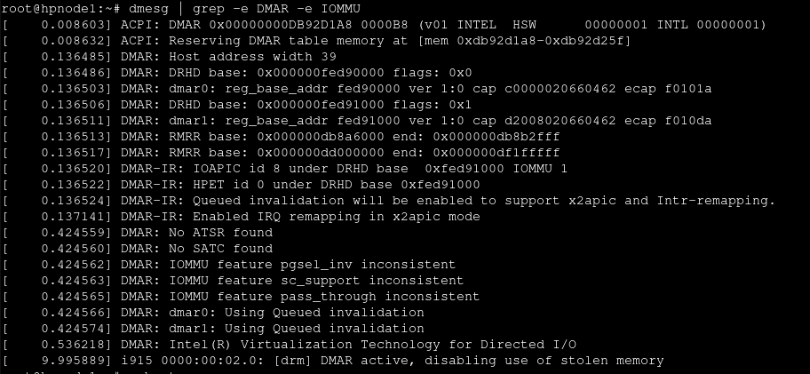
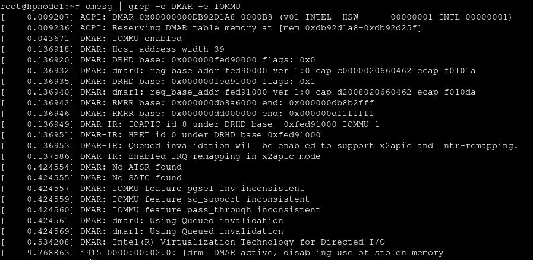

## Node Setup
- Each node uses the **XXnode0-ccc.lab** naming scheme
    - XX = Is the machine manufacterer (HP,DELL)
    - 0 = Is the machine number (1,2)

## Baseline Setup
- After install, a post-install script from [Proxmox VE Helper Scripts](https://tteck.github.io/Proxmox/) is ran to setup the repositiory and minor configurations and aswell as an update.
- Enable IOMMU support from the cli (Intel CPU)
    
    - Go to the shell and `nano /etc/default/grub`
    - Comment out `GRUB_CMDLINE_LINUX_DEFAULT="quiet"`
    - Add `intel_iommu=on iommu=pt` to the `GRUB_CMDLINE_LINUX_DEFAULT` line
    - `GRUB_CMDLINE_LINUX_DEFAULT="quiet intel_iommu=on iommu=pt"`
    - Save and exit
    - Run `update-grub`
- Edit the modules
    - `nano /etc/modules`
    - Add the following to the end of the file
    ```
    vfio
    vfio_iommu_type1
    vfio_pci
    ```
    - Save and exit
    - Run `update-initramfs -u`
- Check to see if IOMMU is enabled by running `dmesg | grep -e DMAR -e IOMMU`
    

## Cluster Setup
- Dedicate a node to be the master server (hpnode1-ccc.lab)
